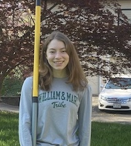

# Elizabeth Upright: Wicked Problems 

Hello! My name is Elizabeth Upright, and this is my repository for the course, Wicked Problems. I am a freshman at William & Mary, and I will be a pole vaulter on the Track & Field team. Along with doing sports, I enjoy playing with my cats, cooking, and doing puzzles. I am currently undecided on a major, but data science seems like an interesting field to explore. 

## Index of Projects & Assignments

1. [Getting Started: 8/24/20](getting_started.md)
2. [Data Management Basics: 8/27/20](data_management_basics.md)
3. [Project 1 Part 1: 9/4/20](project1part1.md)
4. [Project 1 Part 2: 9/13/20](project1part2.md)
5. [Project 2 Part 1: 9/20/20](project2.md)
6. [Project 2 Part 2: 9/27/20](project2part2.md)
7. [Project 2 Part 3: 9/30/20](project2part3.md)
8. [Project 3 Part 1: 10/8/20](project3part1.md)

## Index of Reflections

1. [Data Science Reflection #1: 9/10/20](reflection1.md)
2. [Data Science Reflection #2: 10/1/20](reflection2.md)
3. [Data Science Reflection #3: 10/16/20](reflection3.md)
