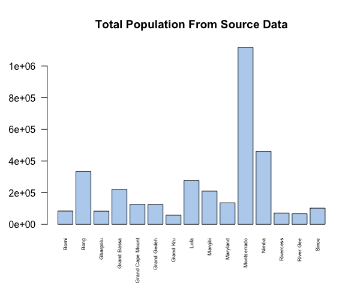
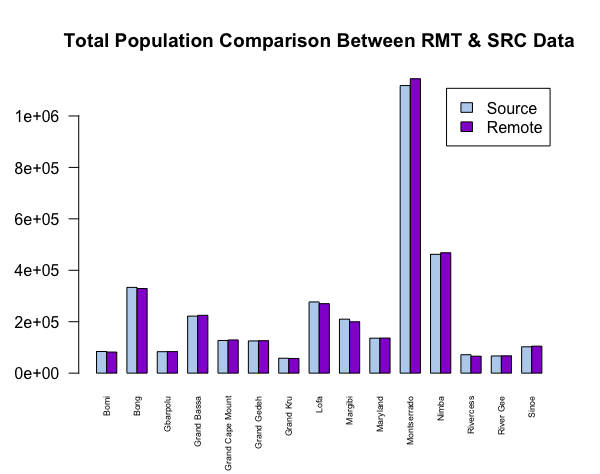
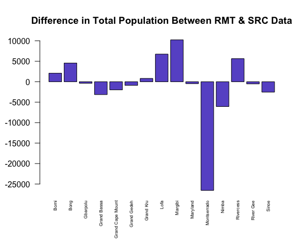
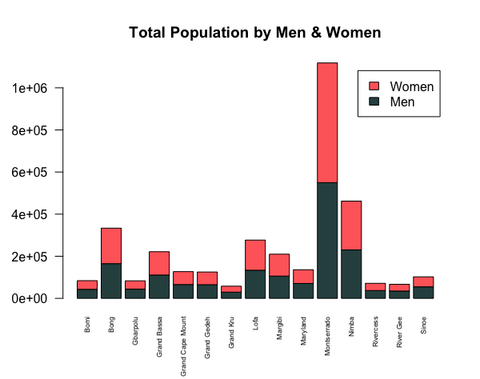
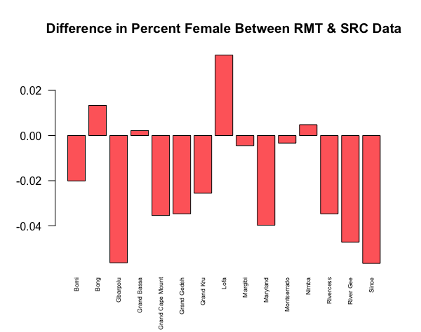
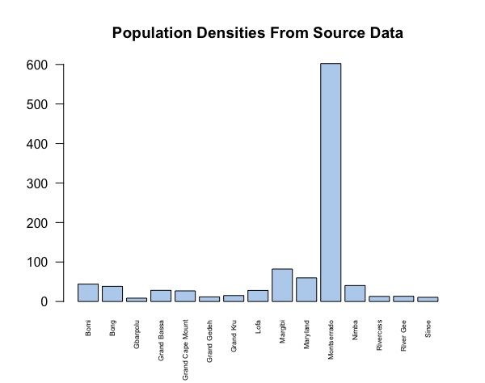

# Data Management Basics Assignment: Bar Plots

This assignment asked us to use both source and remote population data from counties in Libera to create several bar plots. Before I could make the plots, I first had to create, re-order, and re-name some of the columns in the data sets. Then, I created the bar plots by using the barplot() command. Within that command I also specified the title for the bar plot, color of the bars, names of the bars, created a legend, and more.

## The Bar Plots:

