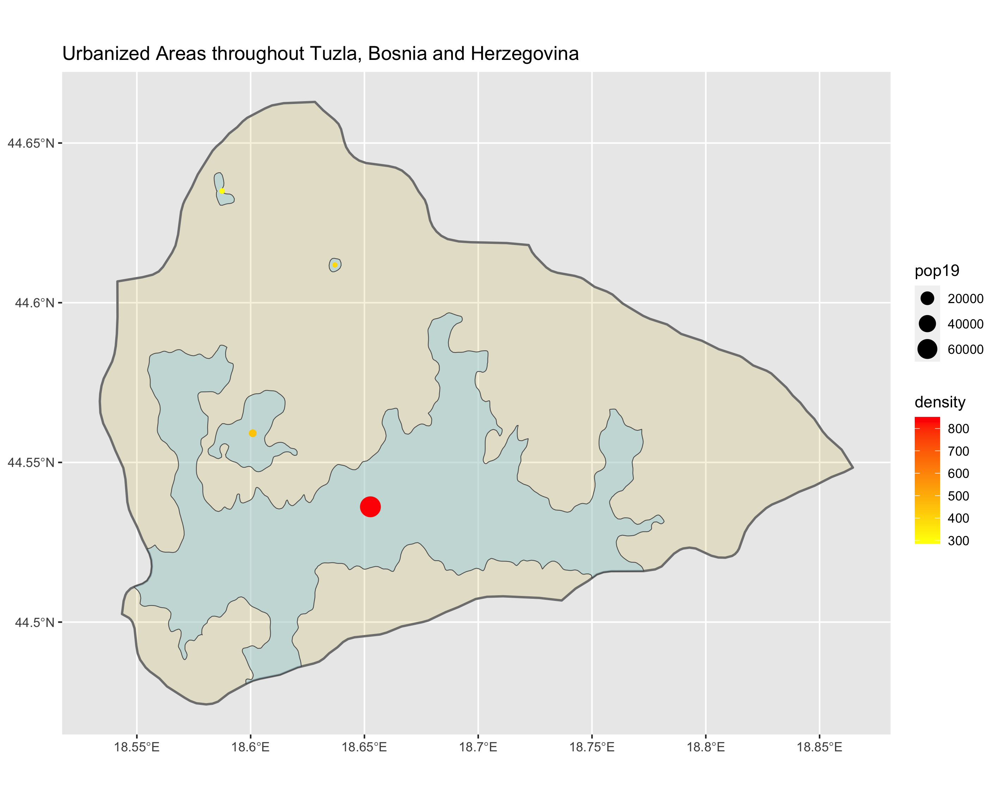
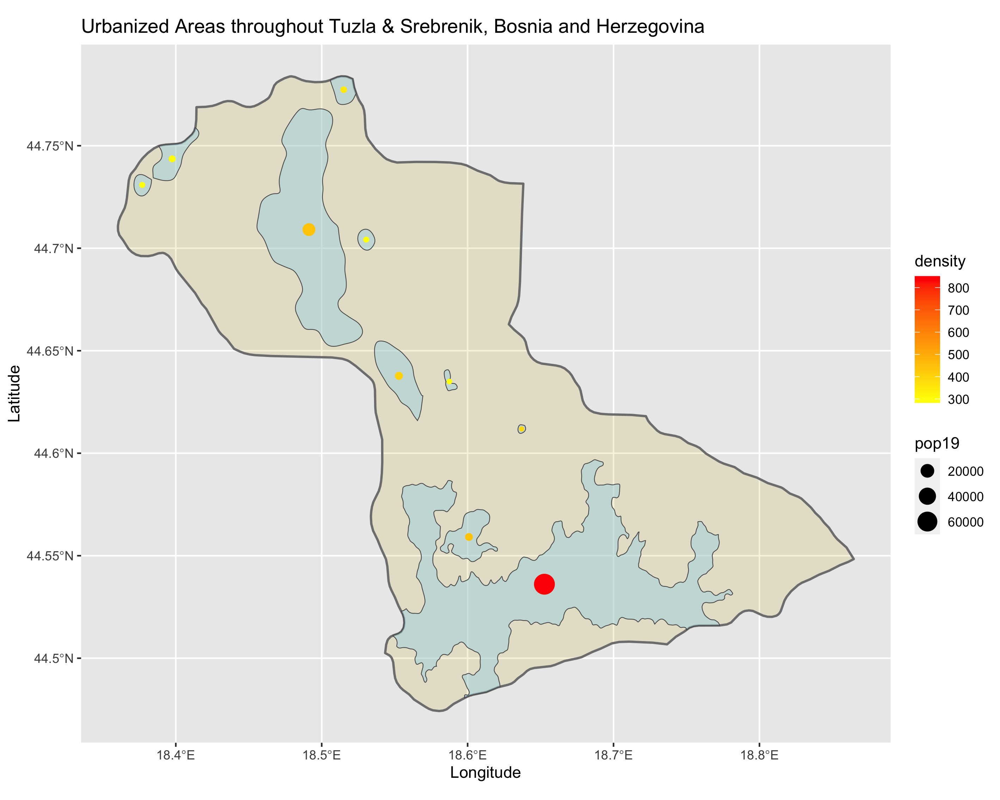
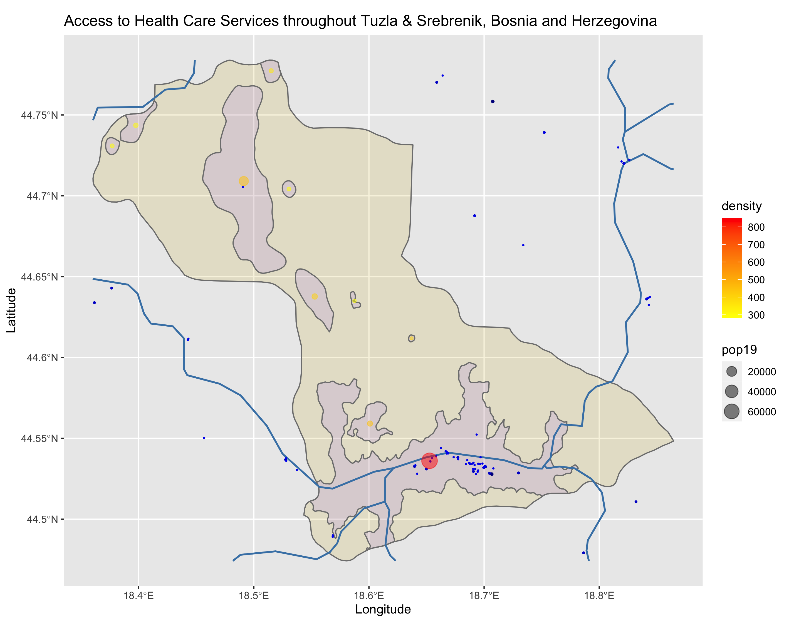
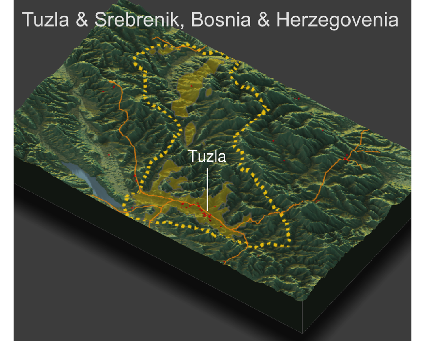

# Final Project: Description of Human Settlements and Urban Areas in Bosnia and Herzegovina

For the final project, I chose to take a closer look at Tuzla, the third largest city in Bosnia and Herzegovina.

## Accessibility 1:

First, I identified and described the urban areas in the municipality of Tuzla as shown in this plot: [Click here for a larger image.](ua_in_tuzla.png)

Then, I combined my previous plot of Tuzla with the municipality of Srebrenik, which boarders Tuzla to the northwest. At first, I wanted to combine my plot of Tuzla with Živince, which boarders Tuzla to the south, in order to show more of a connection with the largest urban area in Tuzla. However, the municipality of Živince was missing a decent area of population data (due to a body of water) which interfered with creating the urban area polygons. Therefore, I created the combined ADM3 plot with the municipalities of Tuzla and Srebrenik: [Click here for a larger image.](combined_ua.png)

## Accessibility 2:

The total combined population for Tuzla and Srebrenik, as of 2013, is 150,657 people. As shown in the plot below, I found there to be around 10 destinctly defined urban areas in the two municipalities, with the largest and most dense urban area being the city of Tuzla. The roadways provided for this area in the shapefile I downloaded were only classified as secondary roads, and as shown in the plot, there aren't many roadways. Given the fact that this area shows the third largest city in Bosnia and Herzegovina, I believe that this roadway data might not be the most detailed or up-to-date, as I believe there should be more than just five roadways. For the healthcare facilities, most are concentrated in the city of Tuzla, which is to be expected as this is a more densily populated area.

Shown below is a plot of the healthcare facilities, roadways, and urban areas in Tuzla and Srebrenik: [Click here for a larger image.](tuz&srehealthcare.png)

## Accessibility 3:

Finally, I overlayed the plot of healthcare facilities, roadways, and urban areas onto the topography of Tuzla and Srebrenik. As shown in the plot below, the topography seems to have influenced the location of the densily populated city of Tuzla, which sits in a valley adjacent to a body of water. On the other hand, the topography doesn't seem to have impacted the location of the roadways because they go across many different elevation changes. Also, the location of the healthcare facilities seem to follow the locations of the urban areas rather than the topography. 

Shown below is the topographical plot of Tuzla and Srebrenik: [Click here for a larger image.](final_tuz&sre.png)

