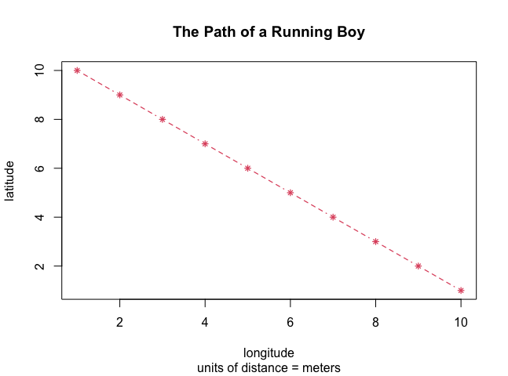
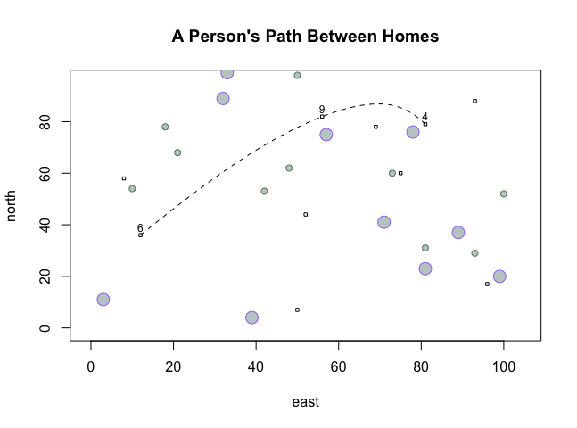
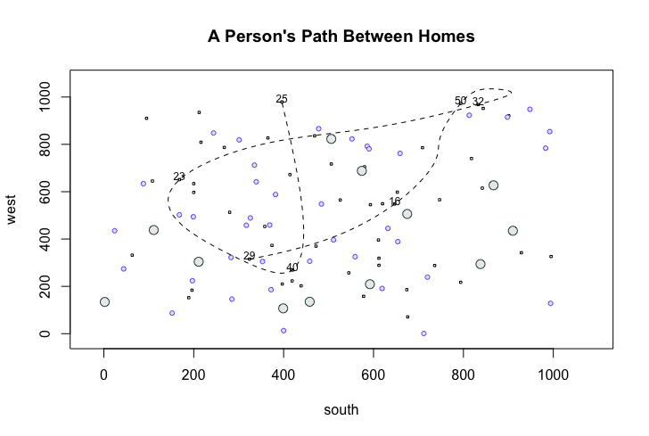

# Getting Started Assignment: Line Plots
The first assignment was to use R & Rstudio to create three line plots.

### The first, simple line plot:
I created the line plot by assigning values to two objects, one named "x" and the other "y". Then, after plotting the objects, I added a title and labels to the plot. Finally, I customized the graph by using arguments to change the linetype, lineweight, color, point symbol, and point symbol scale.

### The more complicated plot:
I created this plot by using the sample() command to ramdomly select coordinates for the different circles (trees) and squares (houses). Then, I created a data frame with the coordinates from the plotted houses. Using this data frame, I created a spline that connected three of the houses and I labeled the houses with their corresponding number.

### The challenge question:
To create the plot for the challenge question, I followed the same principles that I used to make the "more complicated" plot. Except, in this plot, I increased the limits for the area to be from 1 to 1000, and I added more houses and trees than before. This time I used the xspline() command to connect seven of the houses together. With the increased range for the plot, I also had to incrase the size of the houses and the trees.

