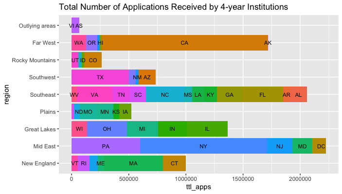
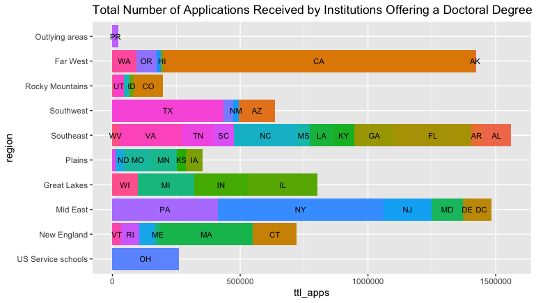
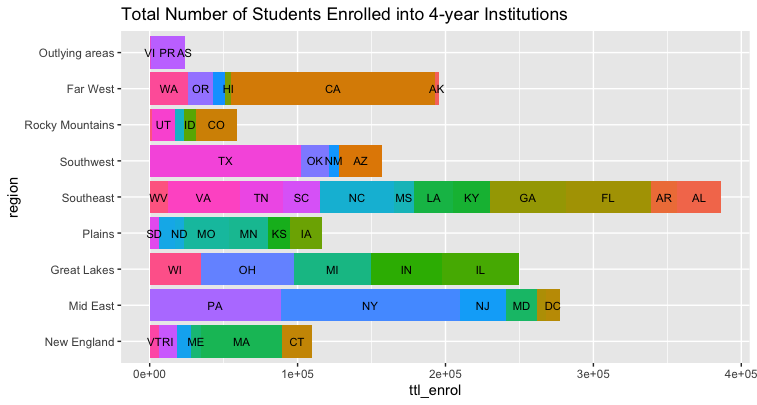
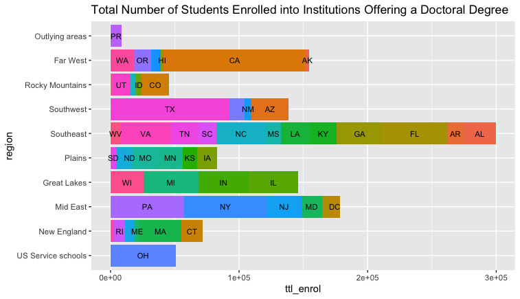

# Project 1 Part 1: Merging, Categorizing, & the Grammar of Graphics
To complete this project, I retrieved and evaluated data from the National Center for Education Statistics. The specific data I evaluated was about the institutional characteristics of American colleges from 2015. Using the Grammar of Graphics, I created two plots that show the relationship between the number of applications received by region and by state for different types of colleges.
## Deliverables:

## Stretch Goal:
The stretch goal for this project asked me to create the same results as the deliverables above, but to compare the number of students enrolled into the schools instead of the number of applicants.

