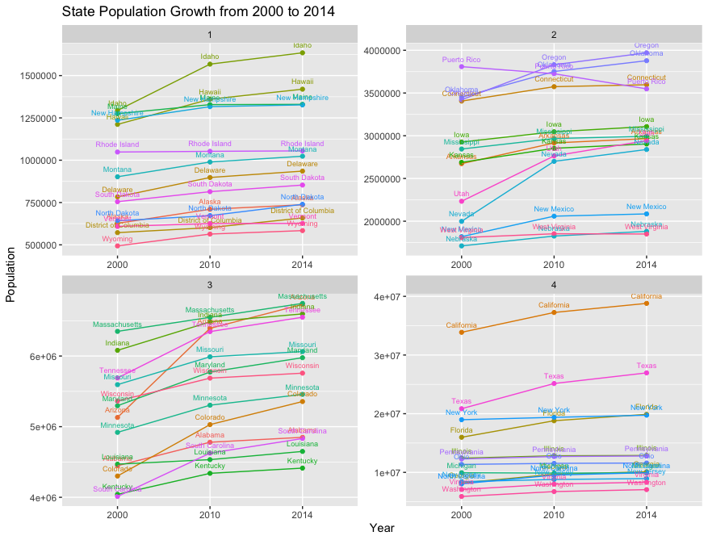
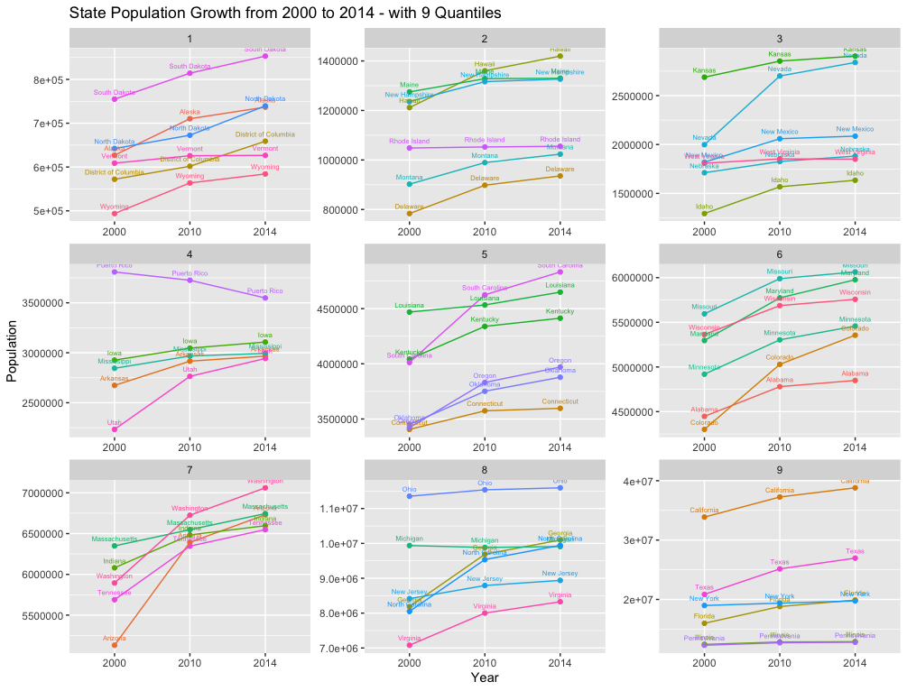

# Project 1 Part 2: Application Program Interfaces & Tidying-Up Your Data

To complete this project, I retrieved data from the US Census Bureau using an application program interface (API). After I imported my data into R I had to clean it up, bind three data sets together, and convert from a wide format into a long format. From there, I had to divide the data into four separate quartiles to make the plotted data readable. Finally, I plotted the data using ggplot.

## Deliverable:

## Stretch Goal:

For this stretch goal, I had to plot the same data as in the deliverable, but instead creating nine equal quartiles of data that are plotted in a three-by-three grid.

