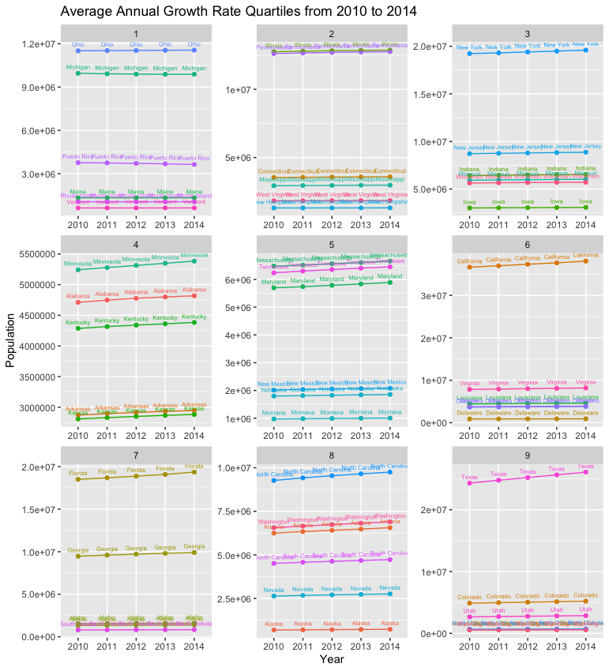
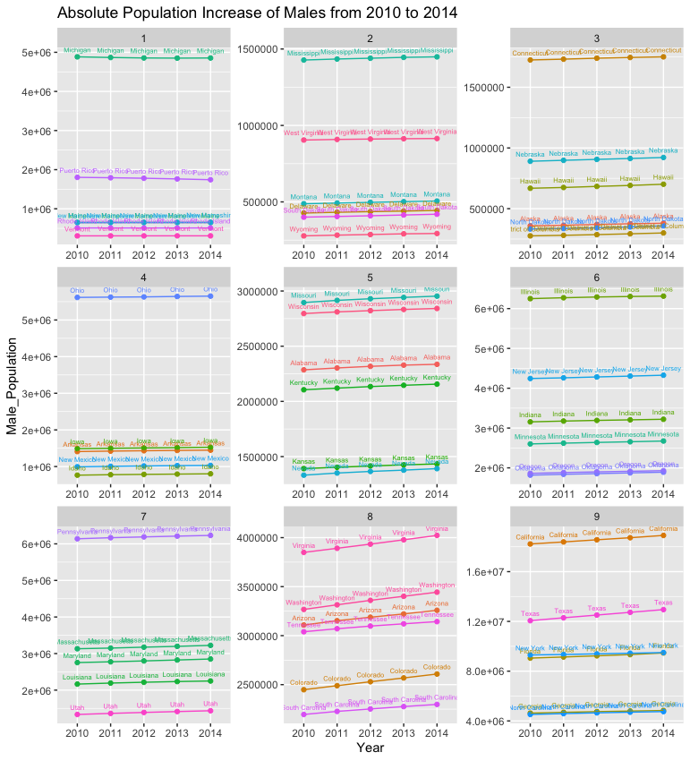
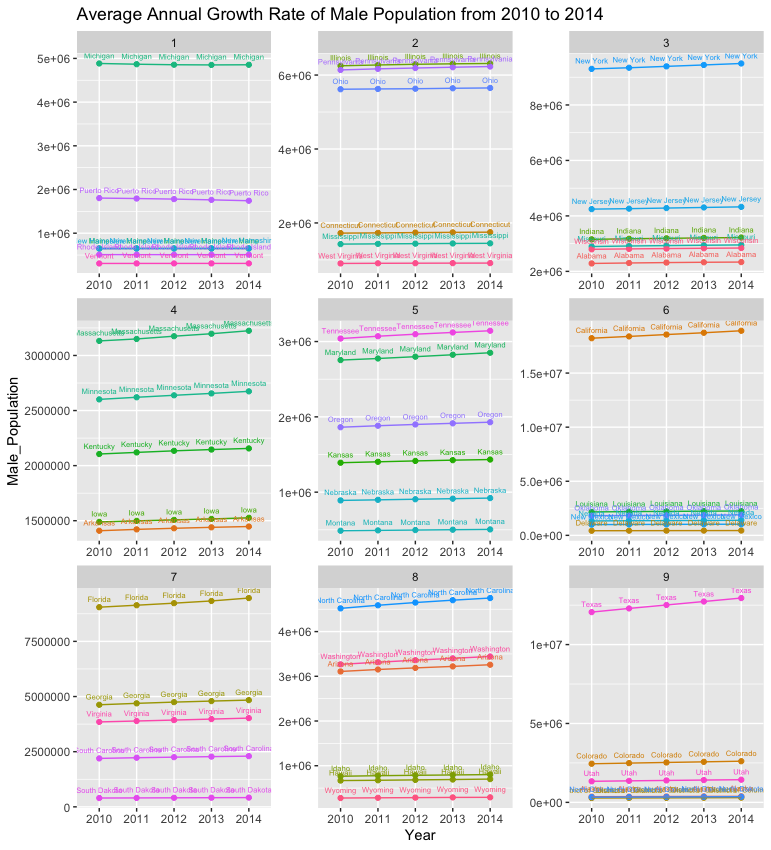

# Project 2 Part 1: Independently Accessing an API & Creating Plots

For this project, I accessed and retrieved data from the American Community Survey by using an API. I accessed data for the total populations of each state for the years 2010 to 2014. Then, I merged all of the data together and split it into nine quartiles based off of the total population increase as well as the average annual growth rate. Finally, I graphed the data into two plots using ggplot2. Each plot shows the total state populations from 2010 to 2014, but the data is split into different quartiles based off of the two different factors.

### Deliverables:

### Stretch Goal:

For the stretch goal, I conducted the same data analysis, also at the state level. However, in these plots, I analyzed the change in the total male population for each state, rather than the absolute total population.

