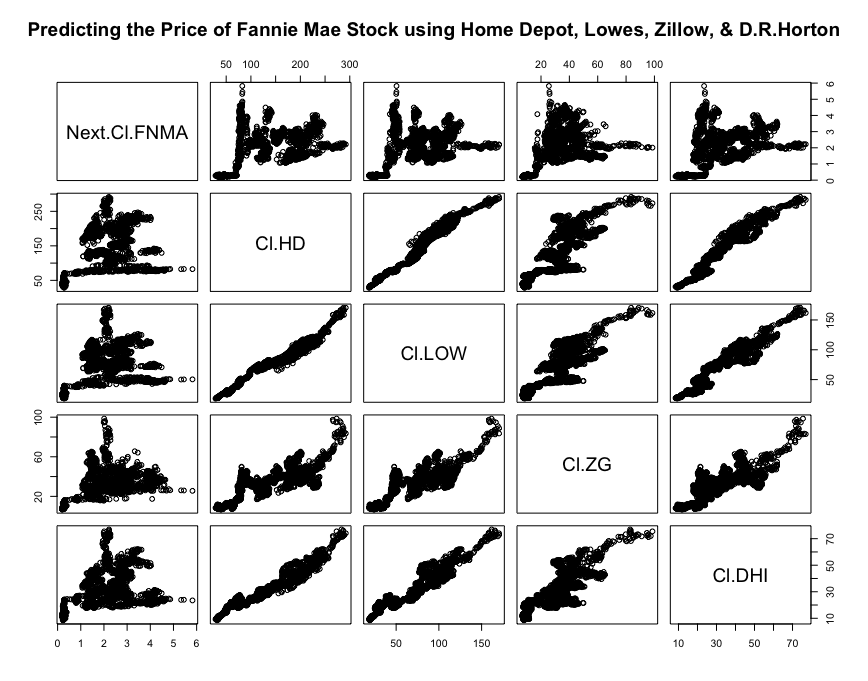
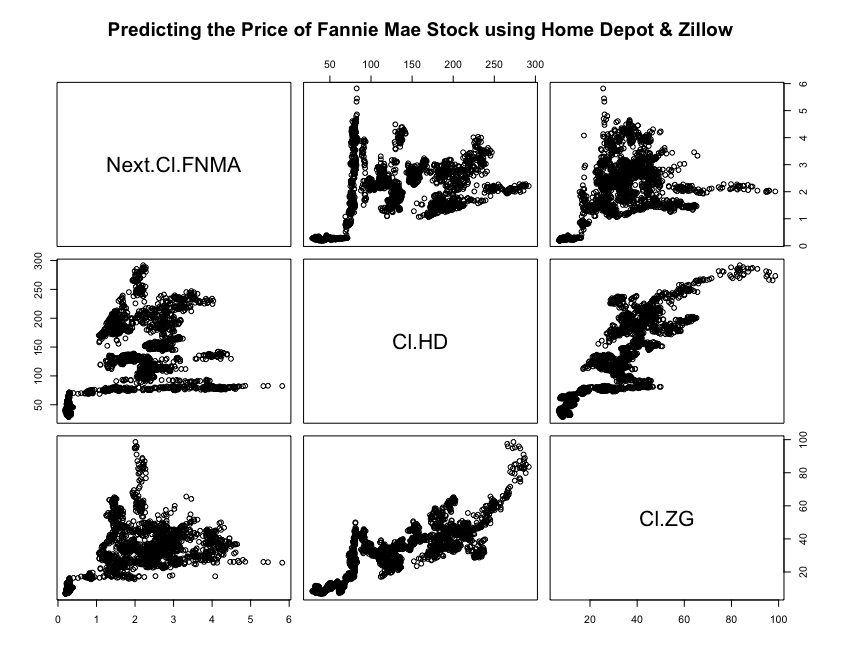
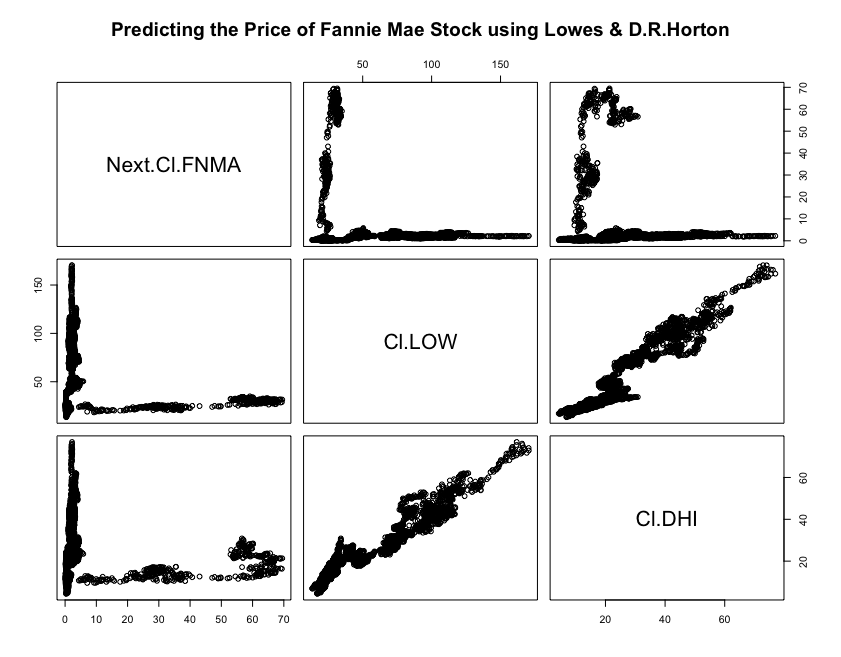

# Project 2 Part 2: Using the Stock Market to Describe, Analyze, & Predict

For this part of the project, I used the "quantmod" package to retrieve and analyze data about companies that are currently being traded on the stock market. With this package, I collected stock data from the internet from five different companies: Fannie Mae, Home Depot, Zillow, Lowes, and D.R.Horton. Then, using this data, I created several models to predict the closing price of Fannie Mae tomorrow based on the closing price today of the other stocks. I then plotted these models as matrices to visualize the relationships between the stocks. Lastly, I created a statistical model with the predicter stocks and calculated the R-squared value to show the predictive power of the stocks. 

## Matrices:

[Click for a larger image](fannie_allplot.png)
This matrix show the relationship between the closing price tomorrow of Fannie Mae's stock and the closing price today of the four predictor stocks; Home Depot, Lowes, Zillow, and D.R.Horton.

[Click for a larger image](fannie_HD_ZGplot.png)
This matrix shows the relationship between the closing price tomorrow of Fannie Mae's stock and the closing price today of Home Depot and Zillow.

[Click for a larger image](fannie_LOW_DHIplot.png)
This matrix shows the relationship between the closing price tomorrow of Fannie Mae's stock and the closing price today of Lowes and D.R.Horton.

## [Statistical Model](statmodel2.pdf)

Clicking on this header will bring you to the statistical model I created that displays the predictive power of the four stocks to acurately predict the price of Fannie Mae stock. As shown by the R-squared values, these stocks are not acurate predictors of the stock price of Fannie Mae, despite them all being involved in the housing industry.
