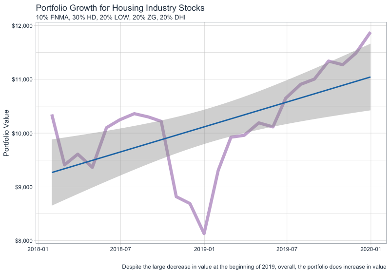
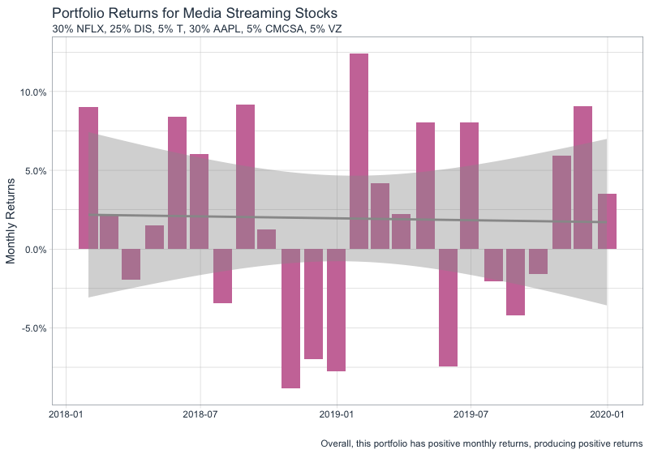

# Project 2 Part 3: Using Tidyquant to Analyze Stock Performance

For this part of the project, I completed more analysis on the stocks I chose for part 2: Fannie Mae, Home Depot, Lowes, Zillow, and D.R.Horton. This time, I created a portfolio containing the stock prices over the last two years and I established the monthly returns for each stock. Then, I modeled what would happen if I invested $10,000 across these stocks. After creating my weighted distribution of the $10,000 I then graphed the total monthy returns of the portfolio. Then, using that same distribution of money, I also graphed the overall growth of the portfolio.

## Deliverables:

## Stretch Goal:

For the stretch goal, I chose six different stocks to work with: Netflix, Disney, AT&T, Apple, Comcast, and Verizon. With these stocks I did the same analysis as I did with the previous portfolio. Then, I also compared different possible distrubutions of the $10,000 on one line graph. 

