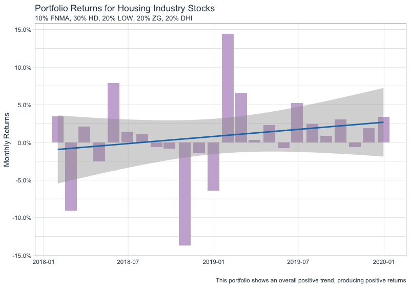
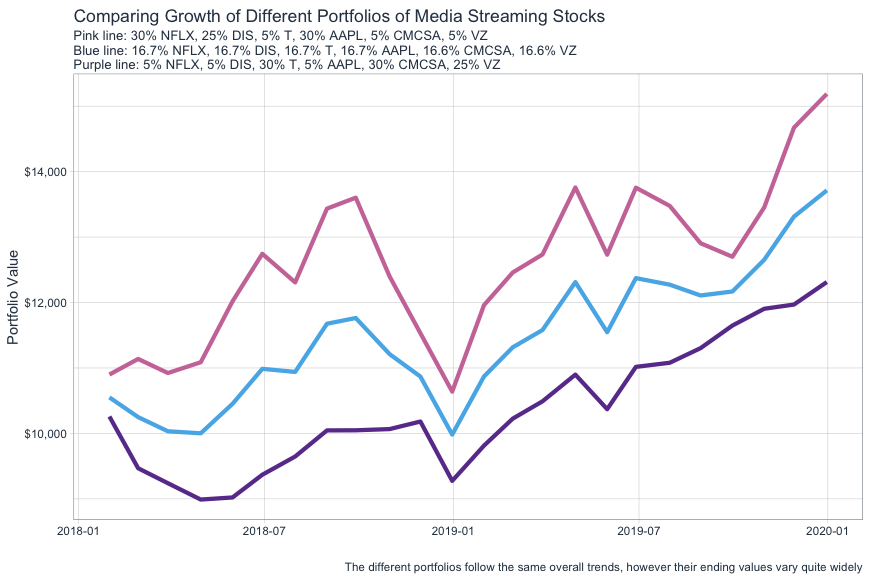
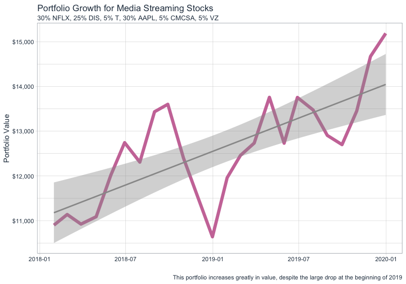

# Project 2 Part 3: Using Tidyquant to Analyze Stock Performance

For this part of the project, I completed more analysis on the stocks I chose for part 2: Fannie Mae, Home Depot, Lowes, Zillow, and D.R.Horton. This time, I created a portfolio containing the stock prices over the last two years and I established the monthly returns for each stock. Then, I modeled what would happen if I invested $10,000 across these stocks. After creating my weighted distribution of the $10,000 I then graphed the total monthy returns of the portfolio. Then, using that same distribution of money, I also graphed the overall growth of the portfolio.

## Deliverables:

## Stretch Goal:

For the stretch goal, I chose six different stocks to work with: Netflix, Disney, AT&T, Apple, Comcast, and Verizon. With these stocks, I created three different portfolios with different distributions of the $10,000. The first portfolio had the $10,000 concentrated mostly in Netflix, Disney, and Apple. The second portfolio invested the money evenly across all six stocks. The third portfolio concentrated the money in AT&T, Comcast, and Verizon. Then, I compared the overall growth of these three portfolios by plotting their line graphs on the same graphic.

This graphic has the first portfolio as the pink line, the second portfolio as the light blue line, and the third portfolio as the purple line. As shown by the graphic, the values of the portoflios follow the same general trend, but the first portfolio easily out performs the other two at the end of the two year period.

In the following graphs, I further analyzed the first portfolio. I created a graph of its total monthly returns and another graph of its overall growth, without the other two portfolios.

