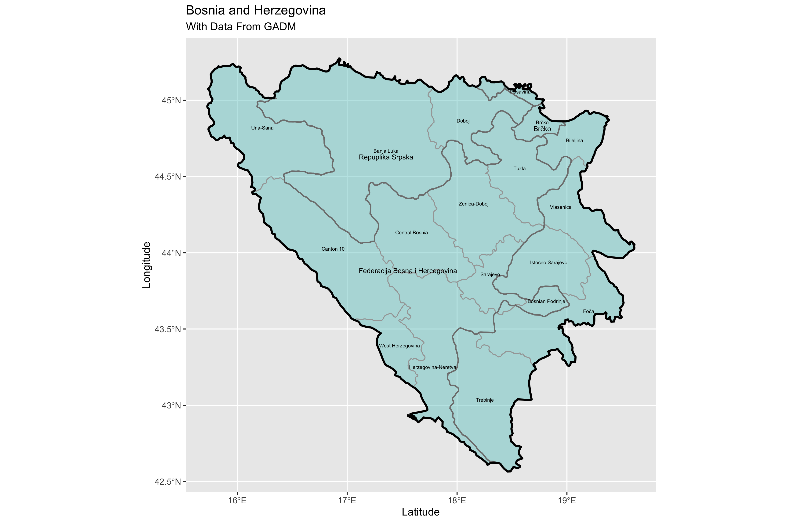
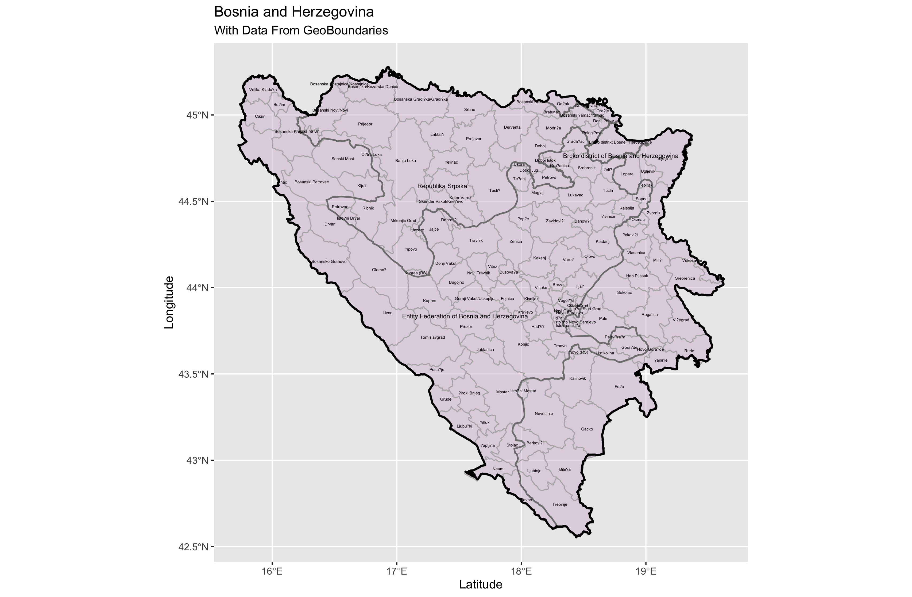
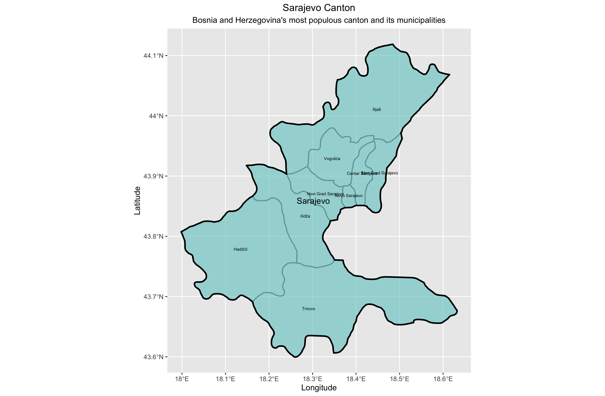
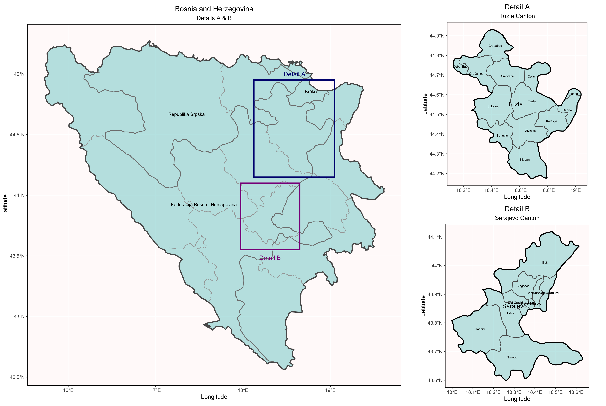

# Project 3 Part 1: Projecting, Plotting, and Labeling Administrative Subdivisions

For this project, I evaluated shapefile data from GADM and geoBoundaries about Bosnia and Herzegovina. With this data, I plotted the international boarder, entities/district, cantons, and municipalities in Bosnia and Herzegovina.

### Deliverables:

 [Click for a larger image.](gadmbihplot.png)
This plot shows the international boarder, entities/district, and cantons in Bosnia and Herzegovina from data collected from GADM. However, I did some research and found that only the Federation of Bosnia and Herzegovina has offical cantons, so I do not know what the ADM-2 divisions in the Republika Srpska represent. 

 [Click for a larger image.](bihplot.png)
For this plot, I used data from geoBoundaries to plot the ADM-0, ADM-1, and ADM-2 boundaries. Compared to the data I got from GADM, the international boarder and the boaders for the entities and district are the same. However, the data stored in ADM-2 varied across platforms. From geoBoundaries, this data represented the boarders of the municipalities. On the other hand, in the data from GADM, ADM-2 held the data for the canton boarders while ADM-3 held the data for the municipalities.

### Stretch Goals:

 [Click for a larger image.](sarajevoplot.png)
This plot shows a closer view of one of the most populous cantons in the Federation of Bosnia and Herzegovina - Sarajevo. Sarajevo contains nine municipalities and it also holds the capital city, Sarajevo.

 [Click for a larger image.](details.png)
Finally, this plot shows more detailed maps of the two most populous cantons in the Federation of Bosnia and Herzegovina - Sarajevo and Tuzla. Unfortunately, due to the fact that the two entities in Bosnia and Herzegovina have different administrative subdivisions, it was difficult to find a proper comparision for population densities. Therefore, I just stuck to comparing the populations of the ten cantons in the Federation of Bosnia and Herzegovina.
