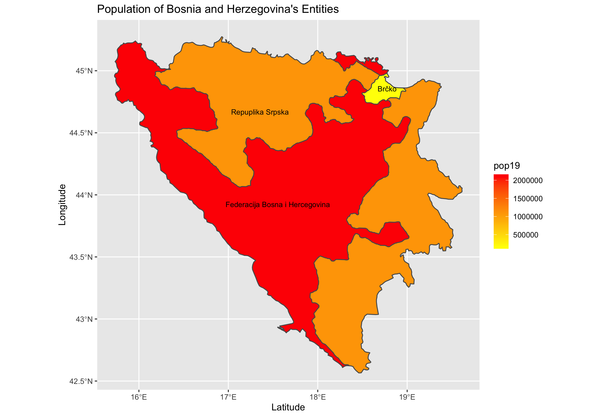
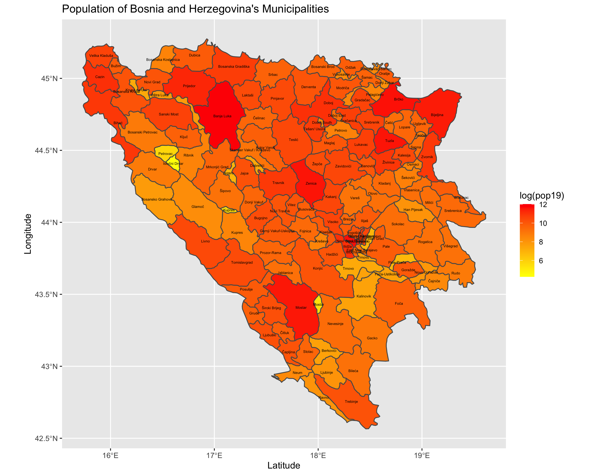
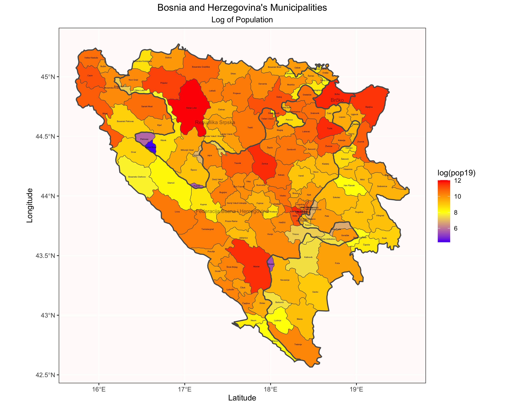

# Project 4: Extracting Populations from a Raster

For this project, I analyzed the population of Bosnia and Herzegovina by creating a raster from data I downloaded from WorldPop. I first organized the population data from the raster by Bosnia and Herzegovina's three entities. Then, I plotted this data by representing the population density on a color scale from yellow (least populous) to red (most populous).

[Click for a larger image.](bihadm1pop19.png)

## Stretch Goals:

For the first stretch goal, I repeated the same process as for the other graph, but I instead organized the population data by Bosnia and Herzegovina's municipalities. The population densities of the municipalities are also represented on the same color scale from yellow (least populous) to red (most populous), however, the color of the municipalites is determined by the log transformation of the population.

[Click for a larger image.](bihadm3pop19.png)

For the second stretch goal, I added the entity labels and boarders into the plot of the municipalities. I also added a third color into the scale making it go from blue (least populous) to yellow (mid population) to red (most populous).

[Click for a larger image.](bihpop19stretchplot.png)

For the third stretch goal, I used the rayshader package to create a 3D plot of the log of density population values for Bosnia and Herzegovina's municipalities. Then, I created a gif of the plot rotating around.

