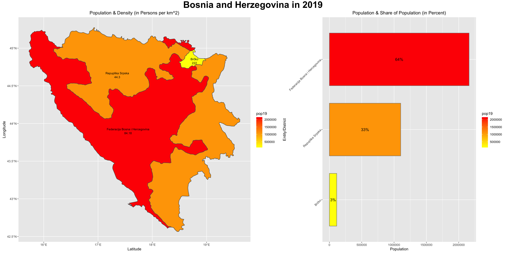
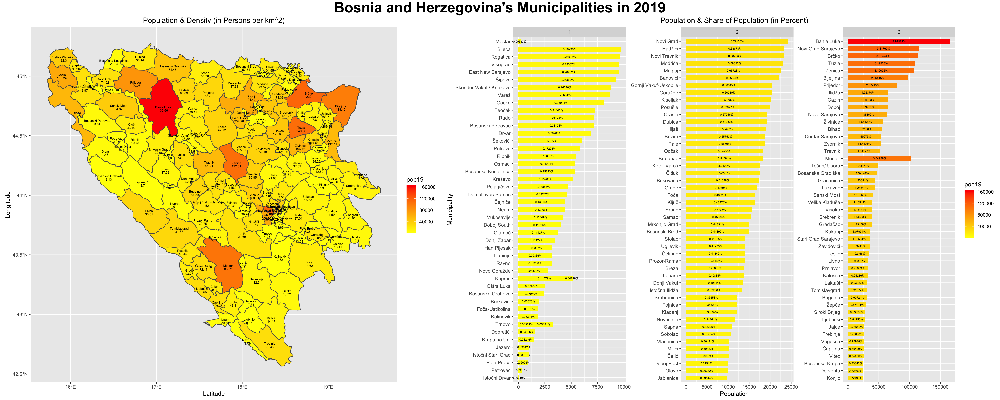
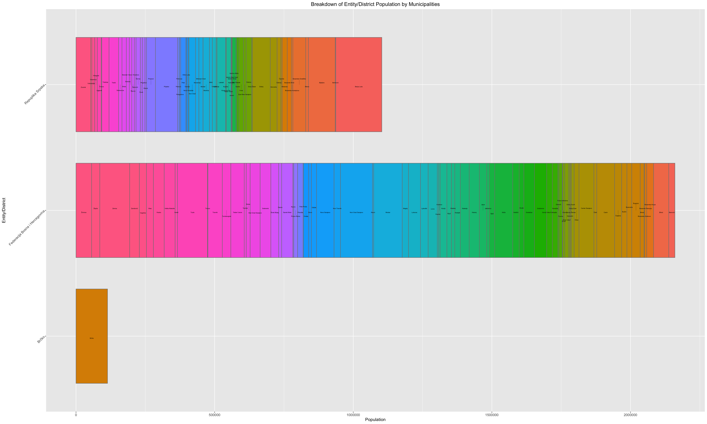

# Project 4 Part 2: Creating a Geometric Bar Plot with a Simple Features Object

For this project, I used the data frames I created in part 1 that contain Bosnia and Herzegovinia's population counts. I then calculated the area and density of the different subdivisions and added this data to the frames. With these data frames, I created bar plots to describe the population distribution over the different subdivisions.

### Deliverables:

[Click here for a larger image.](bih1popdensityplot.png)  This plot shows the distribution of population between the Entities and District in Bosnia and Herzegovina. In both graphs, the color represents the population counts in each subdivision. The bar plot shows how the total population is divided between the three subdivisions, while the geographic plot shows the denisity of the subdivisions.

[Click here for a larger image.](bih3popdensityplot.png)  This plot shows the same information as the other plot, just for Bosnia and Herzegovina's municipalities.

[Click here for a larger image.](bihstretchbarplot.png)  This bar plot shows the population breakdown of the municipalities within their respective entities.
