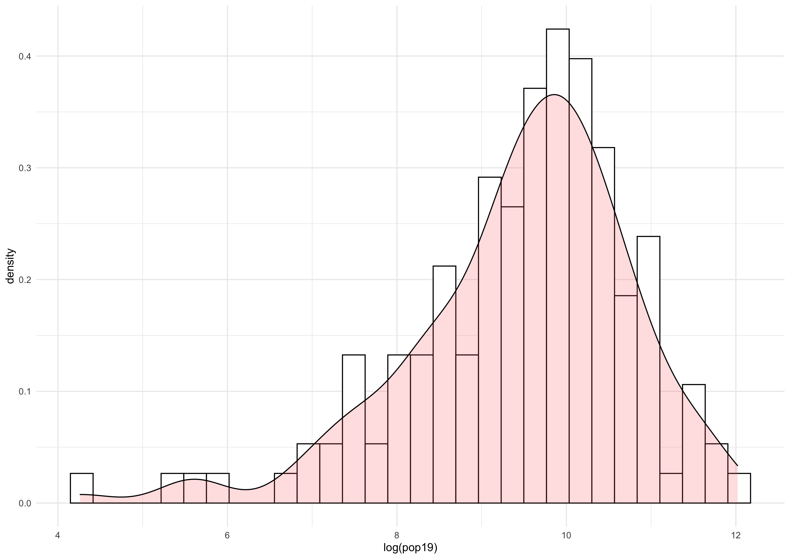
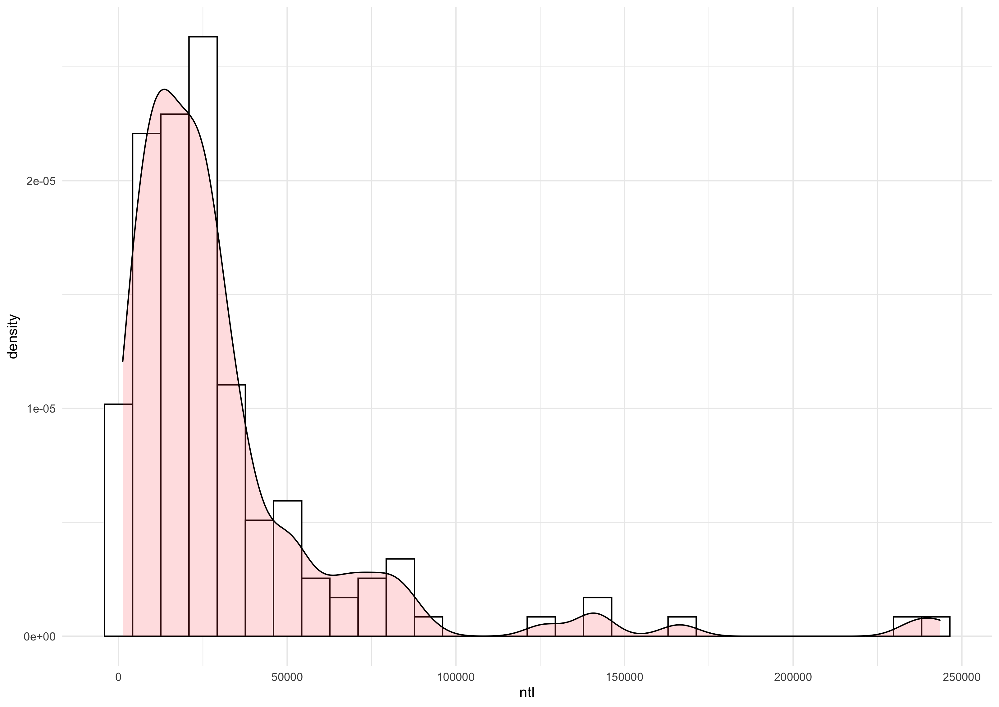
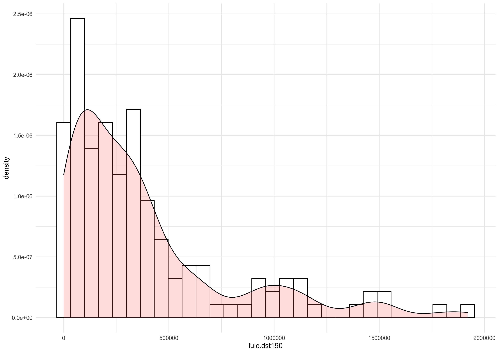
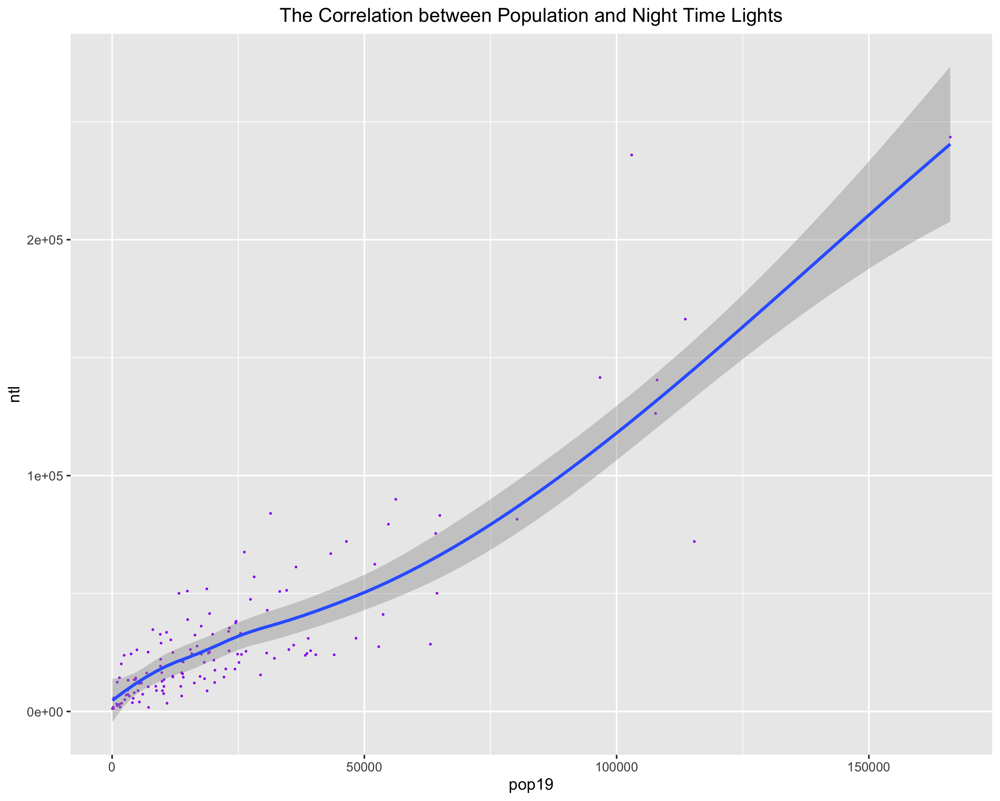
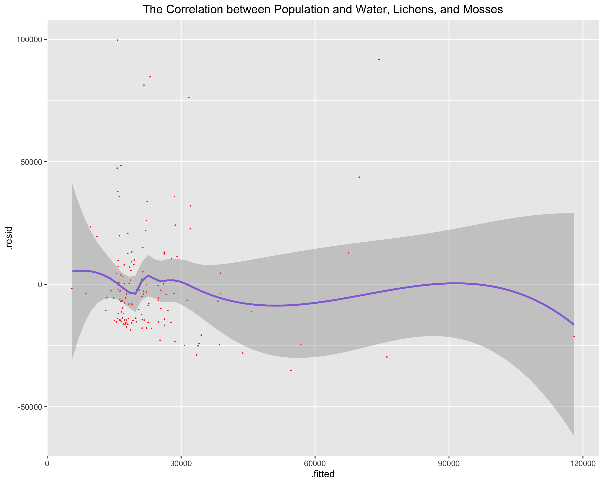
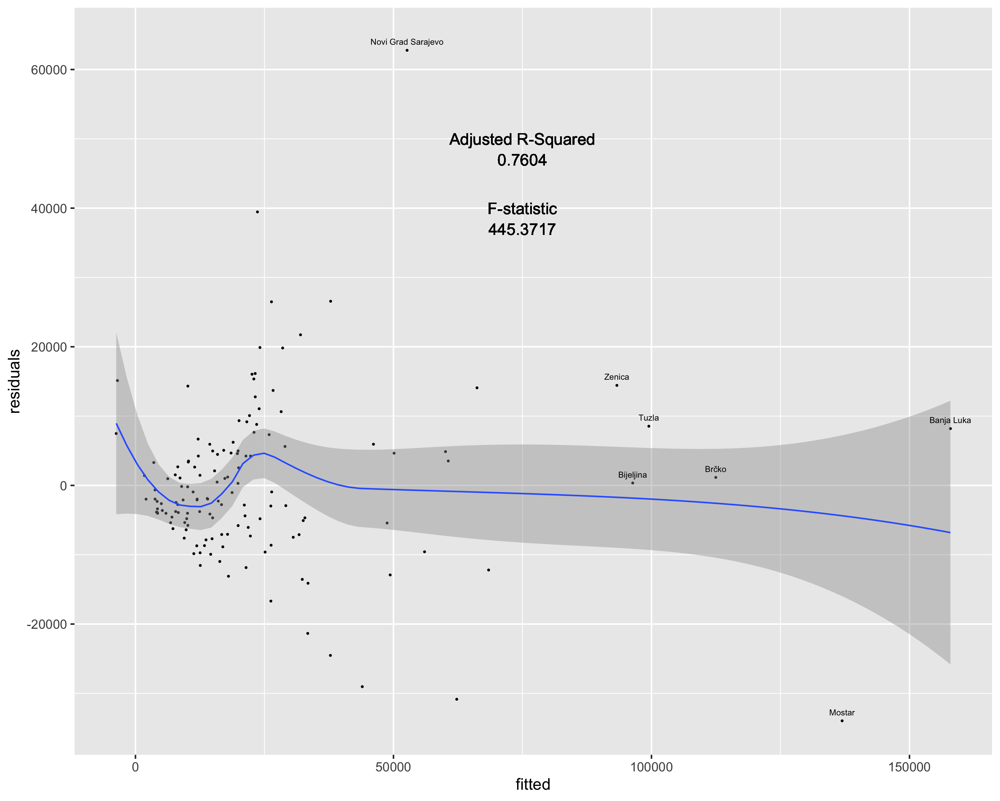

# Project 5: Acquiring, Modifying, and Describing Land Use and Land Cover Data

For this project, I retrieved land use and cover data from the WorldPop website. With this data, I then described and analyzed Bosnia and Herzegovina by creating several density histograms with population and other land use variables as the dependent variables. I also used this data to describe Bosnia and Herzegovina by creating regressions that show the correlation between population, and land use and land cover variables.

## Histograms:

[Click for a larger image.](bihpophist.png) This histogram density plot shows how population is distributed over the different municipalities in Bosnia and Herzegovina.

[Click for a larger image.](bihntlhist.png) This histogram density plot shows how the amount of night time light is distributed over the municipalities. Therefore, the plot demonstrates how most of the municipalities in Bosnia and Herzegovina have just a small amount of night time light.

[Click for a larger image.](bihdst190hist.png) This histogram density plot shows how urban land cover is distributed throughout Bosnia and Herzegovina's municipalities. Very similar to the histogram with night time light, this plot has most municipalities concentrated on left, with little urban land cover.

## Regressions:

[Click for a larger image.](bihpop&ntl.png) This linear model shows that there is a pretty clear positive correlation between the population and amount of night time light in Bosnia and Herzegovina's municipalities. The model consitantly shows that as the amount of night time light increases, so does the population in a particular municipality.

[Click for a larger image.](bihpop&water&140.png) On the other hand, this linear model doesn't show any clear correlation between the population and the amount of water, and lichens and mosses in each municipality. 

## Stretch Goal:
For the stretch goal, I manually created a regression model that shows the correlation between population and all other land use and land cover variables. Then, I labeled some of the more outlying groups of municipalities in the model. Finally, I added the adjusted R-squared and F-statistic as labels onto the plot.

[Click for a larger image.](bihpop&allstretch.png) This linear model doesn't really show a clear correlation between the variables. However, the seven more outlying municipalites that I labeled are also the seven most populus municipalities in Bosnia and Herzegovina ([as shown in this plot](bih3popdensityplot.png)).
